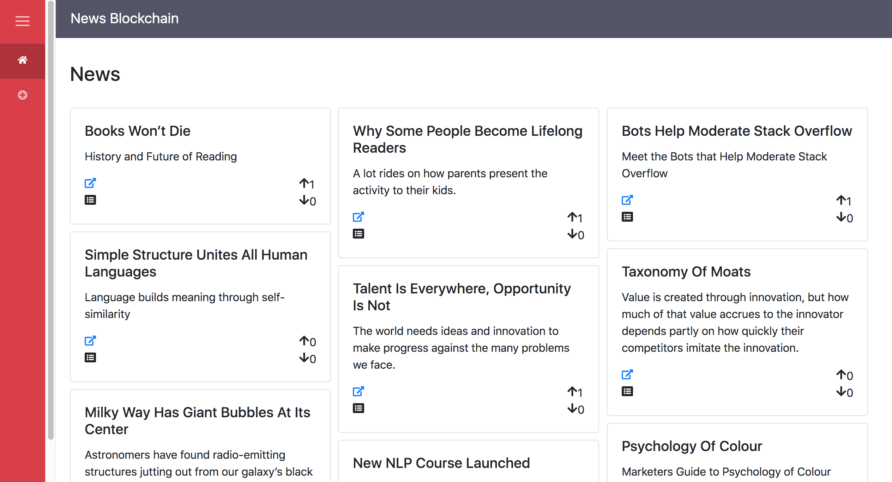
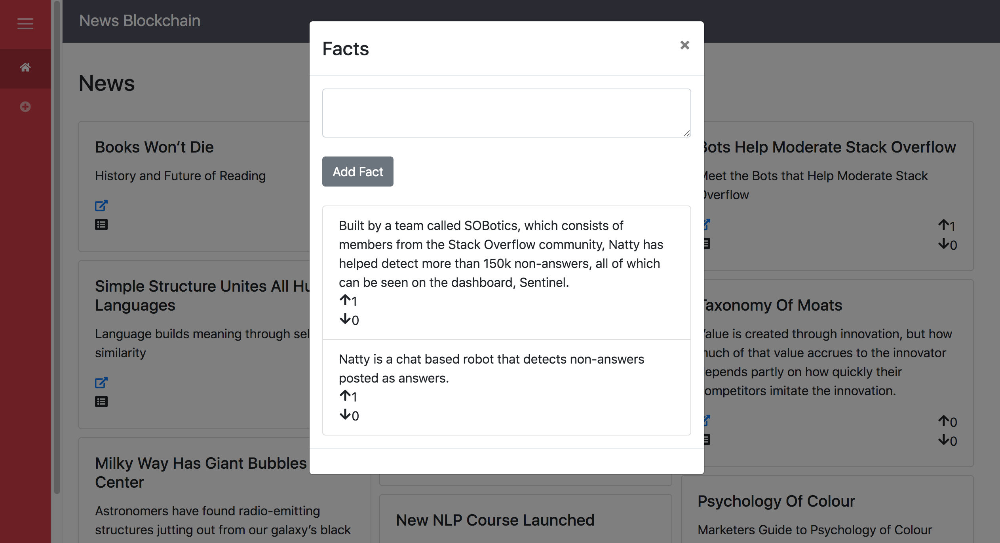
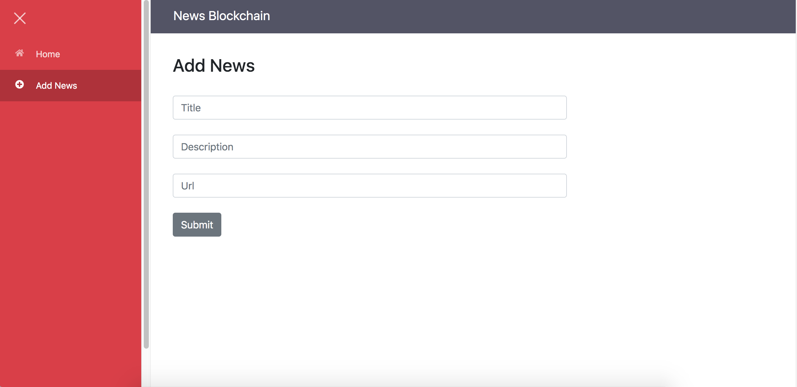

# News Blockchain

News blockchain incentivizes fact checking and quality. It helps to build a curative reputation. It allows credit to be given to original sources.

## Link to Ancillary Material
Pitch Deck: https://docs.google.com/presentation/d/12-48BzSGYHt3msZVZE4iVKukzCOz-Avt-AvBt2sP3yI

## Project Launch Page
Metamask extension is required to test the app. Change the network to "Binance Smart Chain - Testnet" using metamask for the app to work.

https://newsblockchain.netlify.com

## Screenshots

### News List


### Facts for a News


### Add News


## Getting Started

1) Clone Repo

    ```
    git clone https://github.com/viraja1/news_blockchain.git
    ```
    
2) Change directory
    
   ```
   cd news_blockchain
   ```
   
3) Deploy the smart contract using remix IDE (contracts/Media.sol)
   
4) Update smart contract address

    Update smart contract address in client/src/components/contract.js:6
    
    ```
    vi client/src/components/contract.js
    ``` 

5) Build client app

    ```
    cd client
    npm install
    ```
    
6) Start client app

    ```
    npm start
    ```
    
7) Open client app url in chrome

    ```
    http://localhost:8080
    ```
    
8) Test the App

    Make sure that you have configured Binance Smart Chain - Testnet using metamask 
    (https://academy.binance.com/en/articles/connecting-metamask-to-binance-smart-chain)
    
    Faucet: https://testnet.binance.org/faucet-smart
    
                
